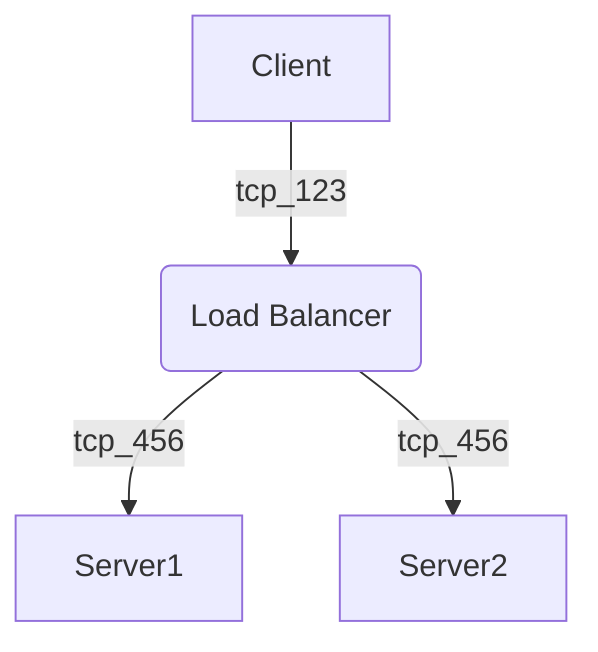

A developer's personal site which has some notes which I have run into many times. 

----

Running Notes

`jekyll serve`

graph TD;
    A-->B;
    A-->C;
    B-->D;
    C-->D;

graph TD
A[Client] -->|tcp_123| B(Load Balancer)
B -->|tcp_456| C[Server1] 
B -->|tcp_456| D[Server2]

 [Just the Docs] theme. 

{: .warning }
Example warning box.

----

[^1]: [It can take up to 10 minutes for changes to your site to publish after you push the changes to GitHub](https://docs.github.com/en/pages/setting-up-a-github-pages-site-with-jekyll/creating-a-github-pages-site-with-jekyll#creating-your-site).

[Just the Docs]: https://just-the-docs.github.io/just-the-docs/
[GitHub Pages]: https://docs.github.com/en/pages
[README]: https://github.com/just-the-docs/just-the-docs-template/blob/main/README.md
[Jekyll]: https://jekyllrb.com
[GitHub Pages / Actions workflow]: https://github.blog/changelog/2022-07-27-github-pages-custom-github-actions-workflows-beta/
[use this template]: https://github.com/just-the-docs/just-the-docs-template/generate
